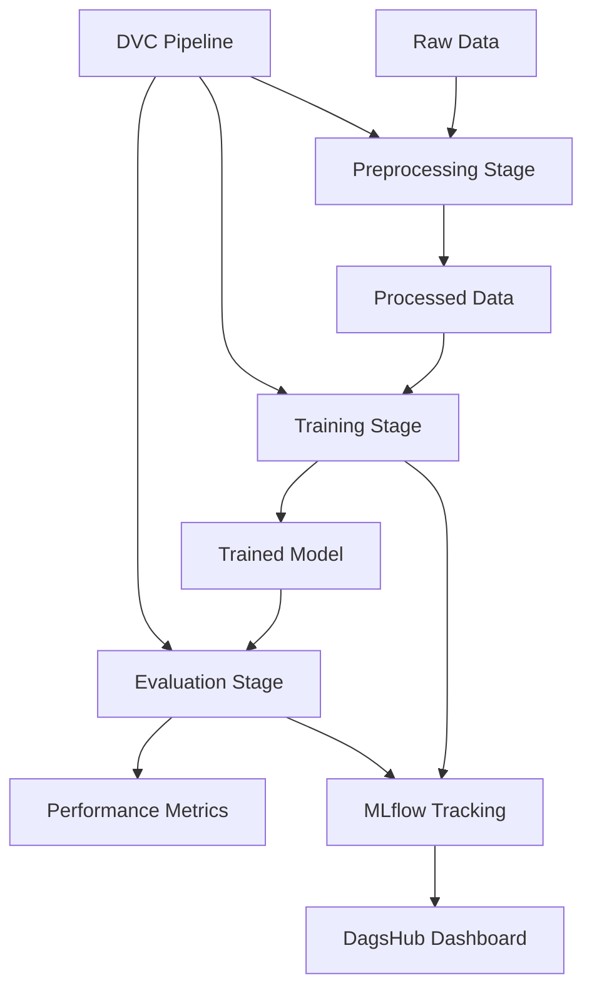

# 🧠 Machine Learning Pipeline with DVC & MLflow

[](https://www.python.org/downloads/)
[](https://dvc.org/)
[](https://mlflow.org/)
[](https://scikit-learn.org/)

[](https://dagshub.com/jagadeshchilla/machineLearningPipeline.mlflow)

> **An end-to-end machine learning pipeline demonstrating best practices for reproducible ML workflows using DVC for data versioning and MLflow for experiment tracking.**

## 📋 Table of Contents

- [🎯 Overview](#-overview)
- [✨ Key Features](#-key-features)
- [🏗️ Architecture](#️-architecture)
- [📊 Results](#-results)
- [🚀 Quick Start](#-quick-start)
- [📁 Project Structure](#-project-structure)
- [🔄 Pipeline Stages](#-pipeline-stages)
- [📈 Experiment Tracking](#-experiment-tracking)
- [🛠️ Technology Stack](#️-technology-stack)
- [📖 Usage](#-usage)
- [🤝 Contributing](#-contributing)

## 🎯 Overview

This project demonstrates how to build a **production-ready machine learning pipeline** using modern MLOps tools and practices. The pipeline trains a **Random Forest Classifier** on the **Pima Indians Diabetes Dataset** with full reproducibility, version control, and experiment tracking.

### 🎯 Problem Statement
Predict diabetes onset in Pima Indian women based on diagnostic measurements using machine learning techniques while maintaining full reproducibility and experiment tracking.

## ✨ Key Features

| Feature | Description | Tool |
|---------|-------------|------|
| 🔄 **Reproducible Pipelines** | Automated, version-controlled ML workflows | DVC |
| 📊 **Experiment Tracking** | Comprehensive logging of metrics, parameters, and artifacts | MLflow |
| 🗃️ **Data Versioning** | Track and version datasets and models | DVC |
| 🔧 **Hyperparameter Tuning** | Automated grid search with cross-validation | Scikit-learn |
| 🌐 **Remote Tracking** | Cloud-based experiment management | DagsHub |
| 📈 **Performance Monitoring** | Detailed model evaluation and metrics | MLflow |

## 🏗️ Architecture



## 📊 Results

### 🎯 Model Performance

| Metric | Value | Stage |
|--------|-------|-------|
| **Training Accuracy** | 73.4% | Cross-validation |
| **Evaluation Accuracy** | 94.4% | Full dataset |
| **Best Parameters** | `max_depth=None, n_estimators=200` | Grid Search |

### 📈 Performance Visualization

```
Training Accuracy: ████████████████████████████████████████████████████████████████████████ 73.4%
Evaluation Accuracy: ████████████████████████████████████████████████████████████████████████████████████████████ 94.4%
```

### 🔍 Hyperparameter Search Results

- **Total Combinations Tested**: 24
- **Cross-Validation Folds**: 3
- **Best Configuration**: 
  - `n_estimators`: 200
  - `max_depth`: None (unlimited)
  - `min_samples_split`: 2
  - `min_samples_leaf`: 1

## 🚀 Quick Start

### Prerequisites

- Python 3.10+
- Git
- Virtual Environment (recommended)

### Installation

```bash
# Clone the repository
git clone https://github.com/jagadeshchilla/machineLearningPipeline.git
cd machineLearningPipeline

# Create and activate virtual environment
python -m venv venv
venv\Scripts\activate  # Windows
# source venv/bin/activate  # Linux/Mac

# Install dependencies
pip install -r requirements.txt

# Initialize DVC (if not already done)
dvc init
```

### Run the Pipeline

```bash
# Run the complete pipeline
python -m dvc repro

# Or run individual stages
python -m dvc repro preprocess
python -m dvc repro train
python -m dvc repro evaluate
```

## 📁 Project Structure

```
machineLearningPipeline/
├── 📁 data/
│   ├── 📁 raw/                    # Original dataset
│   │   ├── data.csv              # Pima Indians Diabetes Dataset
│   │   └── data.csv.dvc          # DVC tracking file
│   └── 📁 processed/             # Preprocessed data
│       └── data.csv              # Cleaned dataset
├── 📁 src/                       # Source code
│   ├── preprocess.py             # Data preprocessing
│   ├── train.py                  # Model training
│   └── evaluate.py               # Model evaluation
├── 📁 models/                    # Trained models
│   └── model.pkl                 # Serialized Random Forest model
├── 📁 venv/                      # Virtual environment
├── 📄 dvc.yaml                   # DVC pipeline definition
├── 📄 dvc.lock                   # Pipeline execution lock
├── 📄 params.yaml                # Configuration parameters
├── 📄 requirements.txt           # Python dependencies
└── 📄 README.md                  # Project documentation
```

## 🔄 Pipeline Stages

### 1. 🔧 Preprocessing Stage
```yaml
preprocess:
  cmd: python src/preprocess.py
  deps: [data/raw/data.csv, src/preprocess.py]
  params: [preprocess.input_data, preprocess.output_data]
  outs: [data/processed/data.csv]
```

**Purpose**: Clean and prepare raw data for training
- Load raw dataset
- Handle missing values
- Feature engineering
- Save processed data

### 2. 🎯 Training Stage
```yaml
train:
  cmd: python src/train.py
  deps: [data/raw/data.csv, src/train.py]
  params: [train.data, train.model_path, train.random_state, train.n_estimators, train.max_depth]
  outs: [models/model.pkl]
```

**Purpose**: Train and optimize the machine learning model
- Hyperparameter tuning with GridSearchCV
- Cross-validation (3-fold)
- Model serialization
- MLflow experiment logging

### 3. 📊 Evaluation Stage
```yaml
evaluate:
  cmd: python src/evaluate.py
  deps: [src/evaluate.py, models/model.pkl, data/raw/data.csv]
```

**Purpose**: Evaluate model performance and log metrics
- Load trained model
- Performance evaluation
- Metrics calculation
- Results logging to MLflow

## 📈 Experiment Tracking

### MLflow Integration

Our pipeline integrates with **MLflow** for comprehensive experiment tracking:

- **Parameters**: Hyperparameters, data paths, model configurations
- **Metrics**: Accuracy, precision, recall, F1-score
- **Artifacts**: Trained models, confusion matrices, classification reports
- **Environment**: Python version, package dependencies

### DagsHub Dashboard

View live experiments and results:
🔗 **[Experiment Dashboard](https://dagshub.com/jagadeshchilla/machineLearningPipeline.mlflow/#/experiments/0)**

## 🛠️ Technology Stack

| Category | Technologies |
|----------|-------------|
| **Core ML** |    |
| **MLOps** |   |
| **Development** |   |
| **Tracking** |  |

## 📖 Usage

### Configuration

Edit `params.yaml` to customize pipeline parameters:

```yaml
preprocess:
  input_data: data/raw/data.csv
  output_data: data/processed/data.csv

train:
  data: data/raw/data.csv
  model_path: models/model.pkl
  random_state: 42
  n_estimators: 100
  max_depth: 5
```

### Pipeline Commands

```bash
# Check pipeline status
python -m dvc status

# View pipeline DAG
python -m dvc dag

# Run specific stage
python -m dvc repro <stage_name>

# Force re-run all stages
python -m dvc repro --force

# View metrics
python -m dvc metrics show
```

### Adding New Stages

```bash
# Add a new pipeline stage
python -m dvc stage add -n <stage_name> \
    -d <dependencies> \
    -o <outputs> \
    -p <parameters> \
    <command>
```

## 🔍 Monitoring & Debugging

### Pipeline Visualization
```bash
# Generate pipeline visualization
python -m dvc dag --dot | dot -Tpng -o pipeline.png
```

### Logs and Debugging
```bash
# Verbose pipeline execution
python -m dvc repro -v

# Check specific stage logs
python -m dvc repro <stage> -v
```

## 🤝 Contributing

We welcome contributions! Please see our [Contributing Guidelines](CONTRIBUTING.md) for details.

### Development Setup

1. Fork the repository
2. Create a feature branch: `git checkout -b feature-name`
3. Make your changes and test thoroughly
4. Commit your changes: `git commit -m "Add feature"`
5. Push to the branch: `git push origin feature-name`
6. Submit a pull request

## 🙏 Acknowledgments

- **Dataset**: Pima Indians Diabetes Database from UCI ML Repository
- **Tools**: DVC, MLflow, Scikit-learn communities
- **Platform**: DagsHub for experiment tracking and collaboration

## 📞 Contact

- **Author**: Jagadesh Chilla
- **Email**: [your-email@example.com]
- **LinkedIn**: [Your LinkedIn Profile]
- **GitHub**: [@jagadeshchilla](https://github.com/jagadeshchilla)

---

⭐ **If you found this project helpful, please give it a star!** ⭐